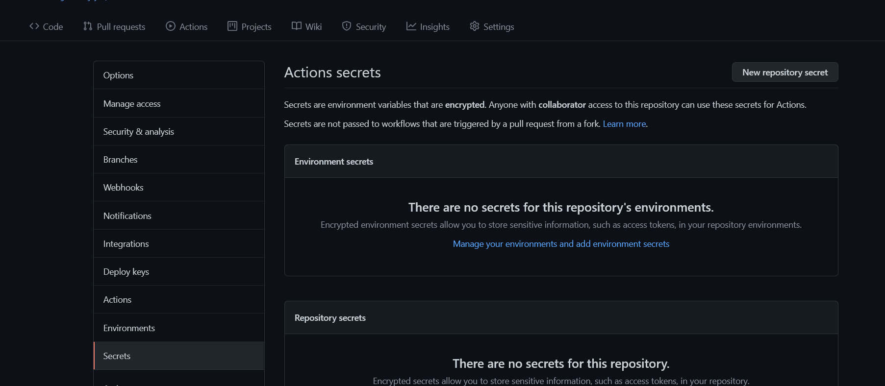
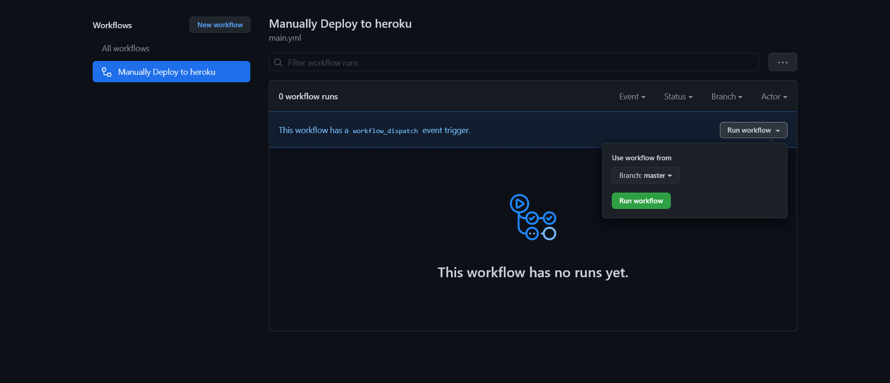

<h1>𝐌𝐚𝐧𝐮𝐚𝐥𝐥𝐲 𝐃𝐞𝐩𝐥𝐨𝐲 𝐂𝐥𝐨𝐧𝐞𝐁𝐨𝐭 𝐯𝐢𝐚 𝐇𝐞𝐫𝐨𝐤𝐮 𝐗 𝐆𝐢𝐭𝐡𝐮𝐛 𝐀𝐜𝐭𝐢𝐨𝐧𝐬</h1>
<h3>𝘛𝘩𝘪𝘴 𝘱𝘢𝘨𝘦 𝘸𝘪𝘭𝘭 𝘵𝘦𝘭𝘭 𝘺𝘰𝘶 𝘩𝘰𝘸 𝘵𝘰 𝘥𝘦𝘱𝘭𝘰𝘺 𝘊𝘭𝘰𝘯𝘦𝘉𝘰𝘵 𝘵𝘰 𝘏𝘦𝘳𝘰𝘬𝘶 𝘸𝘪𝘵𝘩𝘰𝘶𝘵 𝘴𝘶𝘴𝘱𝘦𝘯𝘴𝘪𝘰𝘯 𝘶𝘴𝘪𝘯𝘨 𝘎𝘪𝘵𝘩𝘶𝘣 𝘈𝘤𝘵𝘪𝘰𝘯𝘴</h3>

🅦🅐🅡🅝-
> 𝗗𝗼 𝗻𝗼𝘁 𝗔𝗯𝘂𝘀𝗲 𝘁𝗵𝗶𝘀 𝗦𝗲𝗿𝘃𝗶𝗰𝗲 𝗲𝗹𝘀𝗲 𝗚𝗶𝘁𝗵𝘂𝗯 𝗺𝗶𝗴𝗵𝘁 𝗳𝗹𝗮𝗴 𝘆𝗼𝘂𝗿 𝗔𝗰𝗰𝗼𝘂𝗻𝘁

### 👉Pre Requisites
1️⃣ [Heroku Account](https://heroku.com) --- 𝕿𝖍𝖎𝖘 𝖜𝖎𝖑𝖑 𝖕𝖗𝖔𝖛𝖎𝖉𝖊 𝖚𝖘 𝖙𝖍𝖊 𝕿𝖊𝖗𝖒𝖎𝖓𝖆𝖑 𝖙𝖔 𝖉𝖊𝖕𝖑𝖔𝖞 𝖙𝖍𝖊 𝕭𝖔𝖙

3️⃣ [Telegram Account](https://telegram.org) --- 𝕿𝖍𝖎𝖘 𝖎𝖘 𝖙𝖍𝖊 𝕿𝖊𝖗𝖒𝖎𝖓𝖆𝖑 𝖙𝖔 𝖚𝖘𝖊 𝖙𝖍𝖊 𝕭𝖔𝖙

️⃣ [TG Bot Token](https://t.me/BotFather) --- 𝕲𝖊𝖙 𝖞𝖔𝖚𝖗 𝕭𝖔𝖙 𝕿𝖔𝖐𝖊𝖓 𝖙𝖔 𝖘𝖊𝖙𝖚𝖕 𝖙𝖍𝖊 𝕭𝖔𝖙

### Deployment instructions,Some Recomendations and Notes🤗

🔷 **Here I Don't Provide any Deploy button to heroku, We Use Github Actions to Deploy container to Heroku**
 
🔷 **Make sure to Set the vars correctly in Github-Actions** ❌Dont edit/delete any ENV vars from heroku or Dont add any new vars from heroku either...
   > **to edit/add/del ENV vars...Simply go to github actions and rerun the workflow**

🔷 **If you edit any file or Stuff from Git-Repo you will have to RE-RUN the workflow again or else you will face no changes LOL** 

#### Steps

🎈1. **Fork this Repo**

🎈2. **Go to Repository `Settings` -> `Secrets`**
    
    
🎈3. **Now set the below Variables in the Github Repository Secrets**
    [Environmental Variables]
	
	> group_ids = your telegram group ID (leave it blank if you don't want to add one). To get your group id, go to @MissRose_bot and type /id
    > 
    > telegram_token = go to @BotFather and send /newbot to get one
	>
    > user_ids = Your user id (go to @MissRose_bot and type /id to get your id) - If you want to authorize multiple users, add a comma between each ID (ex: 150654065,5897065)
	

🎈4. **After filling the Required vars .... go to Actions and then tap on Run the Workflow**
    

🎉5. **Now wait it for it to deployed to Heroku and Check app logs and Turn on Workers If OFF** **if everything is OK then send /start to the bot and Bot shall reply.